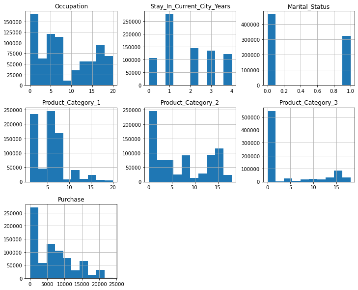

# Tech Mart (fictional big box store) Black Friday Sales Analysis

## Objective

In this project, existing sales data from Tech Mart(fictional) will be used to train a machine learning model that can predict purchase amounts from customer information. This will assist in making profit projections and determining the necessary inventory and staff requirements for the coming season.

## Data Wrangling

This data intially came in two seperate tables that needed to be merged so that cleaning and analysis could occur on the entire dataset. The missing values in this dataset all occur in the Product_Category 2 and 3 columns. The empty values were set to 0. The overall size of the dataset ended up at 783667. 

## Exploratory Data Analysis

This section will delve into the nature of the data. Distributions were analyzed and columns were explored to futher understand what the data is doing and how it might 
affect modeling. Looking into the purchase column revealed that the range was from 0 to 23961 with a mean of 6502 and a standard deviation of 5972. One thing that will be changed later is the large amount of $0 purchase rows. Or rather a lack of purchase. 
Next the age column was analyzed. Below is the distribution of the age column.

This shows that the primary customer demographic age is from 26-35.

Following is the distribution of all numerical columns.

Some interesting points to note about the above distributions: 
- Customers that have only lived in the city for a year or less are more frequent customers. Perhaps this is because they are busy buying things to fill their new space. 
- Clearly there are a large amount of null purchase records. These will be handle prior to the modeling portion.
- Unfortunately, Tech Mart(fictional) was unable to provide us with descriptions of the product_category columns. Becuase of this there is not much information to be had from this
- A final note, single customers make purchases more frequently than married customers.

Looking closely at the purchase column reveals that if the null purchase entries are removed there would be a roughly normal distribution.

The next relationship to be examined was between the age and purchase column.

This shows that there is little variation between age groups and purchase amount. The older customers tend to have larger purchases. Perhaps to avoid too many trips to the store.

Statistically, there is not much that differentiates customers when it comes to marital status and gender.

## Pre-Processing

To prepare the data for modeling certain columns had to be changed to be treated as categoricals. These columns are:
['Gender', 'Age', 'Occupation', 'City_Category', 'Marital_Status', 'Product_Category_1',
       'Product_Category_2', 'Product_Category_3']
       
Once the categoricals were seperated from the numericals a tranformation was performed that resulted in One Hot Encoding. This new data was then recombined with the numerical data. There will be two different sets of processed data that will be trained on. The first will have the product categories marked as numerical. The second will have them marked as categorical. 

These two sets of data were split into their respective train test sets in preperation for training.

## Modeling

The modeling will be approached from a regression stand-point. Followed by a quick investigation into binning the purchase column in order to create a classification problem.
The first three models to be tested are the Random Forest Regressor, Ridge Regressor, and Linear Regressor. Two additional helper functions were created to aid in scoring the fittnes of the models. An additional note is that all data is scaled prior to modeling using the Standard Scaler function from sklearn.

The first set to be trained on has the product_category columns as numerical.
The results are as follows.

- Random Forest: Mean Absolute Error of Test Set: 4252.549139647958
- Ridge: Mean Absolute Error of Test Set: 4747.915902252476
- Linear: Mean Absolute Error of Test Set: 4747.915618764968

In this scenario the Random Forest has the best MAE as 4252.

The next set will have the product category columns as categoricals.

- Random Forest: Mean Absolute Error of Test Set: 4316.035773476157
- Ridge: Mean Absolute Error of Test Set: 4337.825946907134
- Linear: Mean Absolute Error of Test Set: 4338.644853145161

The random forest model seems to have lost some performance with this change. Whereas the other two models have a notable increase.

An additional model will be added. LinearSVR

This resulted in a MAE of 4159.425887440886. The best score yet.

Finally, the null purchase entries will be removed to see there effect on the modeling.

Running the LinearSVR again give an even better score of 2204.7117686920137

Wrapping up the modeling section there will be an attempt at making this into classification problem by binning the purchase column. There will be 10 bins.

First up will be the classifier version of a random forest. Netting a final MAE of 0.9997782092395849. 
Since this is not very helpful, the accuracy metric will be used from now on. The interpretation here would be that at most the classifier was one bin off.

Ultimately, I decided to run two tests. One was a desicion tree classifier using 1-21 for max depth. Its results are represented below.

This resulted in a max depth of 13 and an accuracy of 0.498.

The second was a random forest classifier using the same range for its max depth.

This shows 11 to be the best max depth. Resulting in an accuracy of 0.501

On a whim I threw three more classification problems at the data to test their performance. These had little to no tuning.

- AdaBoost: 0.357
- Bagging: 0.466
- Gradient: 0.481

## Findings

The best performing model is a Linear SVR model, capable of predicting to within 0.37 standard deviations, or approximately $2200. The classification models could not make it past 0.5% accuracy. 
Some interesting notes: the majority of the customers were young, around 25 years old. Customers that had only lived in their current city for a year were also more likely to make purchases. The assumption would be that they are still purchasing basic necessities after having moved recently. Interestingly, all customers had similar purchase averages. With older customers(50-60) spending slightly more.

## Ideas for Further Research:

In future predictions, it would be better to have descriptions of the product categories to improve the ability to make correlations. Perhaps an experiment that specifically analyzes the demographic of the stores customers could lead to some valuable insights. Allowing for specific marketing strategies to be employed. 

## Recommendations for Client:

 -  Market towards the age groups that don’t make as many purchases in hopes that you can increase overall profits. Also improve accessibility for the elderly so that they are more inclined to visit the store.
 -  Capitalize on customers that have just moved. They will be on the look out for great deals to fill the voids left by moving. There could also be an opportunity in marketing to those that have been in the city for longer. Perhaps a push for a new aesthetic would bring more customers to the store.
 -  A final option could be passing generated data to the machine learning model to determine the outcome of the specified data. This could aid in determining slumps in business due to various local changes.
